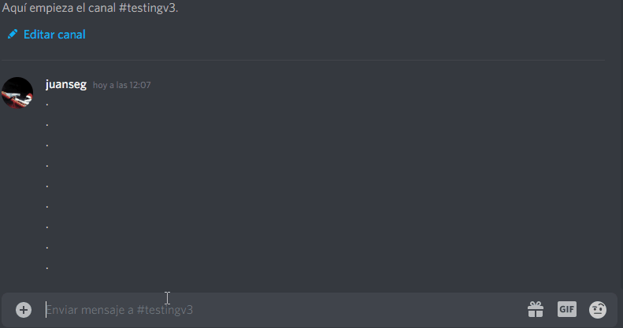
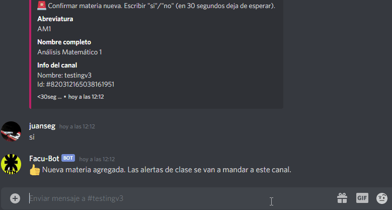
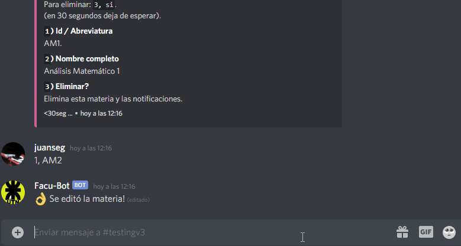
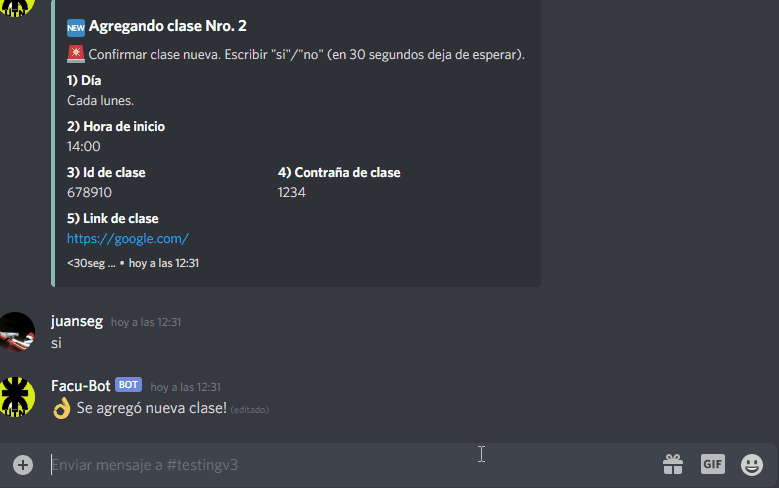
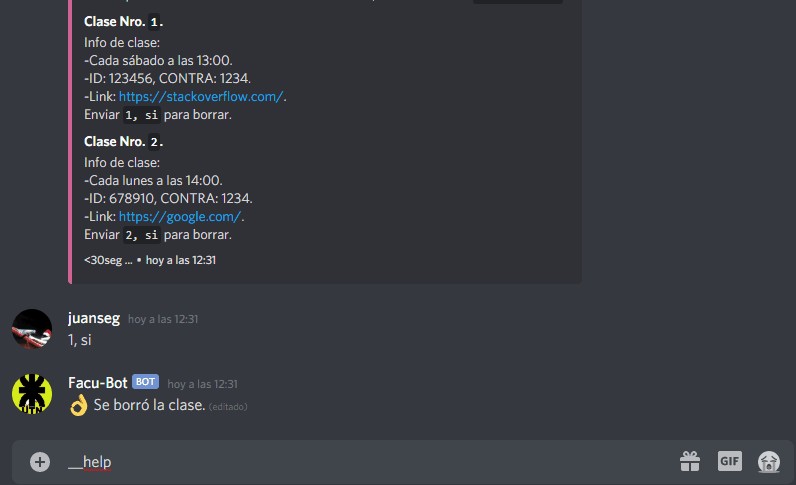
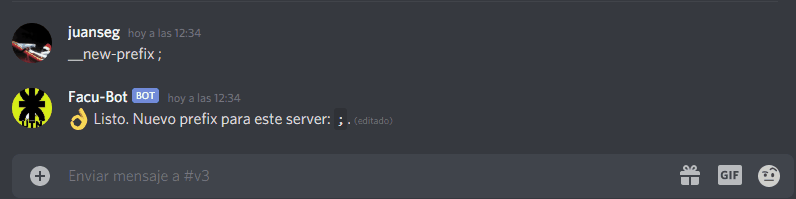

# Facu Bot - Discord.js
<!-- Introducción -->
## ¿Qué hace?

Es un bot de Discord el cual avisa cuando tu clase está por comenzar. Facilitandote el link de Zoom / clase virtual con su ID y Contraseña.

## ¿Cómo funciona?

Los usuarios usan su servidor de Discord como una `carpeta` donde cada canal es una `materia`. Dentro de cada canal puede crearse `clases`. Cada clase necesita los siguientes datos:
- Día de clase de forma abreviada. Por ejemplo: `lun, mar, mie, jue, vie, sab`. No se habilita los domingos.
- Hora de inicio de clase. Ejemplo: `09:00`. Se admite de 07:00 a 23:00 hrs.
- Link directo a la clase.
- ID y Contraseña para ingresar a la clase (de ser necesario).

## Usarlo de forma local

- Clonar este repositorio con `git clone https://github.com/juansegnana/facu-bot.git`
- Ir a la carpeta raíz e instalar dependencias con `npm install`
- Crear archivo `.env` en raíz. Solo necesitas colocar: `TOKEN_BOT=tu_discord_bot_token`. Podés crear un bot y obtener el token desde [Discord Developer Portal](https://discord.com/developers/).
- Ir a la carpeta `db/` y ejecutar `node dbInit -f`, el parámetro `-f` es opcional por si querés borrar toda la base de datos. Este comando solo lo realizas una vez o cada vez que cambies los `Models/` de la DB.
- Para controlar la cantidad de clases que puede tener una materia, se puede ajustar en `config.json` el valor de `LIMIT_PER_MATERIA`.
- Ejecutar `npm run dev` en desarrollo, o bien `npm run start`
<!-- Uso -->
## Comandos
El prefix por defecto es `__`.

### Crear materia
**Comando**: `__crearmateria`
**Uso**: `<abreviatura>, <nombre_materia>`
**Ejemplo**: `__crearmateria AM1, Análisis Matemático 1`
**Nota**: Abreviatura debe ser 2 o más caracteres.

Screenshot

    

### Editar materia
**Comando**: `__editarmateria`
**Uso**: `<campo_a_editar>, <valor_nuevo>`
**Ejemplo**: `1, AM2`
**Nota**: Enviar comando y luego elegir campo a editar. Si querés eliminar la materia enviá `3, si`

Screenshot

    

### Crear clase
**Comando**: `__crearclase`
**Uso**: `<dia-semana>, <hora-inicio>, <id>, <contraseña>, <link-clase>`
**Ejemplo**: `__crearclase sab, 09:30, 123456, 1234, https://google.com/`
**Nota**: Día de semana deben ser las 3 primeras letras sin acentos: `lun, mar, mie, jue, vie, sab`. La hora debe ser entre las 07:00 y las 23:00 hrs. Si es menor a 10:00 colocar un 0 adelante.

Screenshot

    
    

### Borrar materia
**Comando**: `__borrarmateria`
**Uso**: `<clase_a_borrar>, si`
**Ejemplo**: `1, si`
**Nota**: Se van a listar todas las clases creadas en un canal/materia.

Screenshot

    

### Help
**Comando**: `__help`
**Uso**: `[comando]`
**Ejemplo**: `__help crearmateria`
**Nota**: `__help [comando]` es opcional.

Screenshot

    

### Nuevo prefix
**Comando**: `__new-prefix`
**Uso**: `<nuevo_prefix>`
**Ejemplo**: `__newprefix ;`
**Nota**: Se permite 1 cambio por hora (se va a modificar luego).

Screenshot

    

